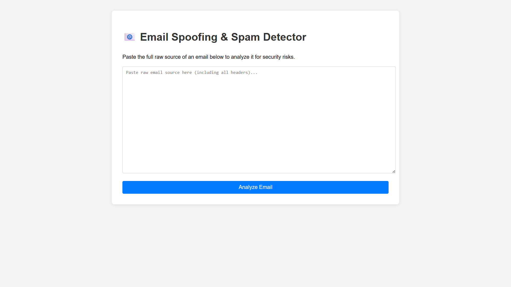
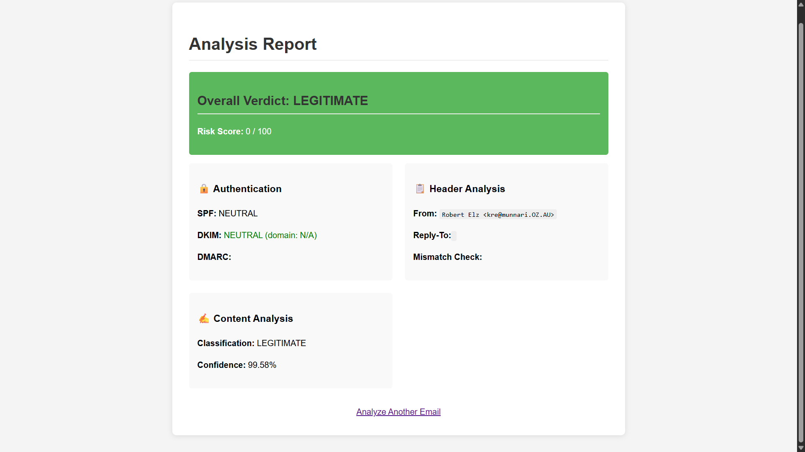
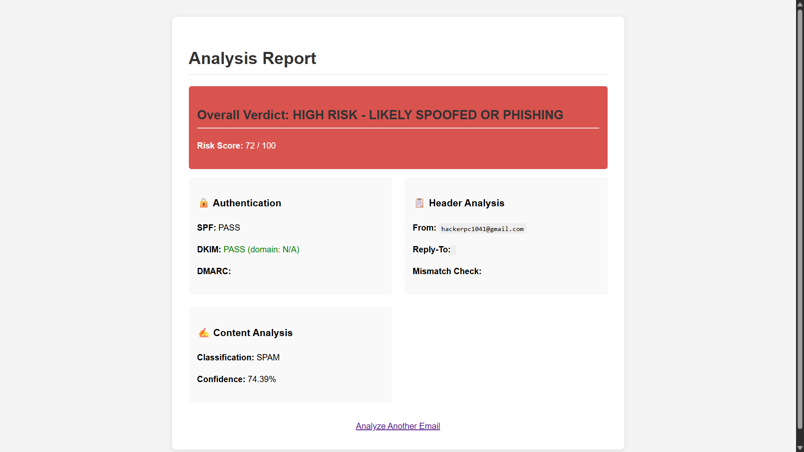

Email Spoofing & Spam Detection System
This project is a web-based tool designed to analyze the raw source of an email and determine its legitimacy. It uses a multi-layered approach to detect signs of email spoofing, phishing, and spam by checking authentication protocols (SPF, DKIM), DMARC alignment, and performing content analysis with a pre-trained machine learning model.

The system also includes a command-line script to send a test spoofed email, allowing you to effectively test the detector's capabilities.

<<<<<<< HEAD
### Screenshots

*The clean, simple interface for pasting raw email source code.*

*Analysis result showing a "LEGITIMATE" verdict with a low risk score.*

*Analysis result showing a "HIGH RISK" verdict, correctly identifying a spoofed email by its failed DMARC alignment.*

=======
Screenshots
1. Main Analysis Page
The clean interface where the user pastes the raw email source.

2. Analysis of a Legitimate Email
Shows a "LEGITIMATE" verdict with a low risk score and passing checks.

3. Analysis of a Spoofed Email
Shows a "HIGH RISK" verdict, clearly highlighting the failed DMARC Alignment, which is the key indicator of a spoofed sender.
>>>>>>> 83b448efb01894660b2cb1c7227b81bffb887bf1

Features
Raw Email Source Analysis: Paste the full source of any email for a deep security analysis.

Authentication Checks: Verifies SPF and DKIM results from the email headers.

DMARC Alignment Verification: The core of spoofing detection. Checks if the domain in the From: header is the same one that authenticated the email.

Content-Based Spam Detection: Uses a pre-trained Naive Bayes classifier to analyze the email's text content for spam-like language.

Risk Scoring: Calculates a weighted risk score (0-100) based on all checks to provide a final, easy-to-understand verdict (LEGITIMATE, SUSPICIOUS, or HIGH RISK).

Spoofing Test Script: Includes a spoofer.py tool to send a test email with a forged From: address to verify the detector is working correctly.

How It Works
The detection process follows these steps:

Parse Email: The raw email source is parsed into a machine-readable object.

Check Authentication: The system reads the Authentication-Results header to determine the status of SPF and DKIM.

Verify DMARC Alignment: It extracts the domain from the From: header and compares it to the domain that passed the DKIM check. A mismatch is a major red flag for spoofing.

Analyze Content: The plain text body of the email is extracted, cleaned (removing stopwords, punctuation), and fed into the trained spam classifier model.

Calculate Risk: A final score is calculated by assigning weights to each finding. A failed DMARC alignment carries the highest penalty.

Display Results: The verdict, risk score, and a detailed breakdown are rendered on the results page.

Project Structure
spam_detector_project/
├── model/
│   └── spam_classifier.joblib
├── templates/
│   ├── index.html
│   └── result.html
├── dataset/
│   ├── easy_ham/
│   └── spam/
├── app.py
├── detector.py
├── requirements.txt
├── train_model.py
└── spoofer.py

Setup and Installation
Follow these steps to get the project running on your local machine.

1. Clone the Repository
git clone <your-repo-url>
cd spam_detector_project

2. Install Dependencies
It is recommended to use a virtual environment.

python -m venv venv
source venv/bin/activate  # On Windows, use `venv\Scripts\activate`
pip install -r requirements.txt

3. Download the Training Dataset
This project is trained on the SpamAssassin Public Corpus.

Download the files:

Easy Ham (Legitimate)

Spam

Create the directory structure: Inside the project root, create a dataset folder with two subfolders: easy_ham and spam.

Extract the files: Extract the contents of the downloaded archives into the corresponding folders.

4. Train the Machine Learning Model
Run the training script from the project root. This only needs to be done once.

python train_model.py

This will create the spam_classifier.joblib file inside the model/ directory.

5. Run the Web Application
python app.py

Open your web browser and navigate to http://127.0.0.1:5001.

How to Use
Analyzing an Email
Open an email in your email client (e.g., Gmail, Outlook).

Find the option to "Show original" or "View source".

Copy the entire raw text, including all headers.

Paste the text into the web application's text area and click "Analyze Email".

Testing with the Spoofer Script
Disclaimer: This script is for educational and testing purposes only. Use it responsibly and only with email accounts you are authorized to use.

Configure spoofer.py:

Open the spoofer.py file.

Set YOUR_EMAIL to your real Gmail address.

Set YOUR_APP_PASSWORD to a 16-digit Google App Password. Do not use your regular password.

Run the script:

python spoofer.py

Follow the prompts to enter the recipient's email and the address you wish to forge.

<<<<<<< HEAD
The test email will be sent. Use its raw source to test the detector.
=======
The test email will be sent. Use its raw source to test the detector.
>>>>>>> 83b448efb01894660b2cb1c7227b81bffb887bf1
